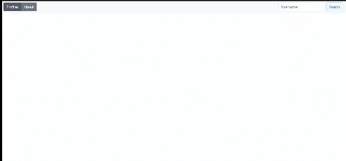

# github-sweng-vis

>Production page at [https://github-sweng-vis-three-teal.now.sh/](https://github-sweng-vis-three-teal.now.sh/)

## Project Information

This site was created as part of the Trinity College Software Engineering module in 3rd year computer science.
The project makes use of a number of technologies to visualize various statistics associated with github members, most notably their
"Punch card stats" and "Language stats". Basic user information is displayed in the first card, including followers, avatar and bio. Along 
with the users 5 most recent starred repositories. It's easy to infer a users interests from their starred repositories. Clicking on the expand icon
will display a list of all of a users starred repositories in a Modal. Any user can be searched against using the "search" field and their username//login name.

The linked [commit](https://github.com/henrym2/github-SWENG-vis/commit/ac0586767b7970184d69594a2960b551d65c778a) shows the initial git API interrogation marked due for the 8th November 2019.



See further examples of pre-searched users in the [docs](docs/) folder. Further information associated with the Project itself, along with a publicly
hosted version can be found at [https://github-sweng-vis-three-teal.now.sh/](https://github-sweng-vis-three-teal.now.sh/).
The Info Tab on the project provides a detail description of the various metrics displayed and why they were used in the project as a whole. Some known issues exist with sizing of the graphs, as something to be aware of.

Below you will find commands required to setup, build, develop and test the project. 

## Project Setup

### Install:

```npm install```

### Serve dev environment:

```npm run serve```

### Build Production:

```npm run build```

### Run tests:

```npm test```